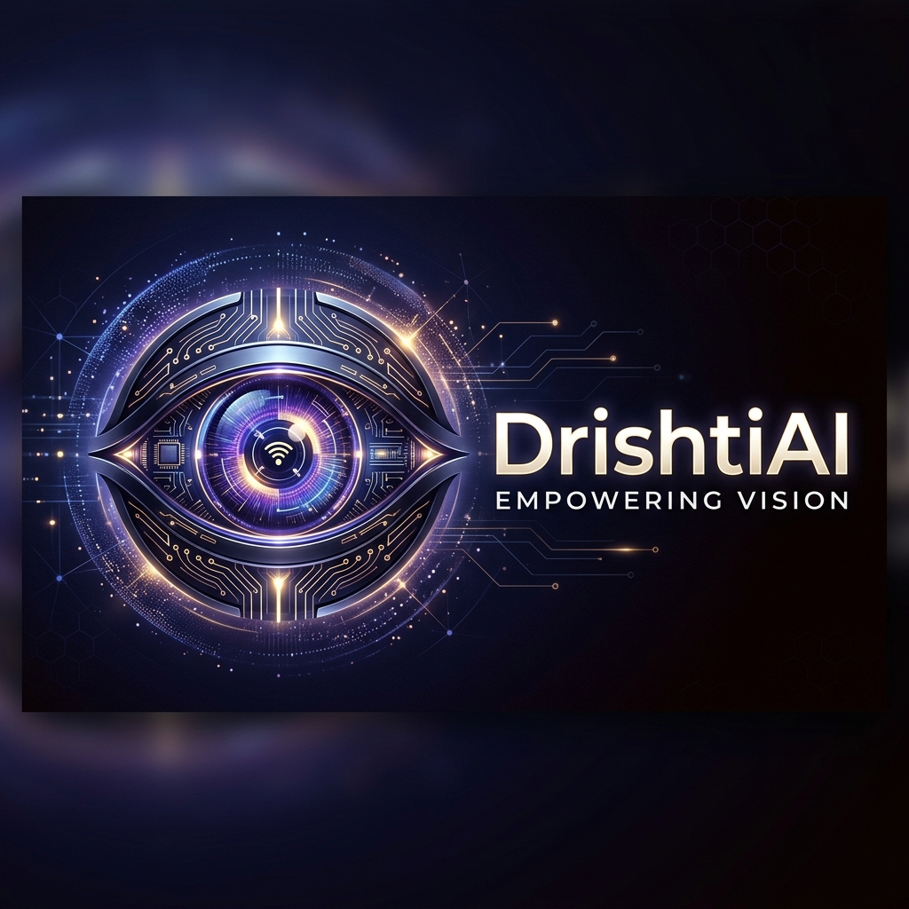

<div align="center">
  

  # DrishtiAI: Empowering Vision
  ### *Intelligent Perception for the Visually Impaired*

  [](https://opensource.org/licenses/MIT)
  [](https://developer.android.com/about)
  [](https://kotlinlang.org/)
  []()

  ---

  **DrishtiAI** is a high-impact, AI-powered visual assistant designed to bridge the gap between perception and accessibility. By leveraging state-of-the-art machine learning, DrishtiAI transforms real-world visual data into actionable auditory and tactile feedback, enabling independence for the visually impaired.

</div>

## 🌟 Features

### 🛡️ Hazard Detection
Real-time environmental scanning to identify obstacles, stairs, and potential hazards in the user's path.
- **Low-latency detection**: Powered by optimized computer vision models.
- **Auditory Alerts**: Discrete, context-aware audio cues for immediate awareness.

### 📜 Narrative AI
Advanced OCR and scene description capabilities that "read" the world to the user.
- **Smart Text Announcement**: Intelligently identifies and reads menus, signs, and documents.
- **Context Filtering**: Filters out noise to focus on the most relevant information.

### 🔍 Smart Filtering
Intelligent logic that prioritizes high-value visual information over environmental clutter.
- **Custom Logic**: Tailored filtering based on user navigation modes.
- **Adaptive UI**: High-contrast, accessibility-first interface for low-vision users.

## 🛠️ Technical Stack

- **Language**: Kotlin (Jetpack Compose)
- **Architecture**: MVVM / Clean Architecture
- **AI/ML**: Optimized for Android (MediaPipe / TensorFlow Lite)
- **Dependency Injection**: Hilt / Dagger
- **Navigation**: Compose Navigation

## 🚀 Getting Started

### Prerequisites

- Android Studio Flamingo or later
- Android SDK 26+ (Android 8.0 Oreo)
- A physical Android device (Recommended for Camera testing)

### Installation

1.  **Clone the repository**:
    ```bash
    git clone https://github.com/ChetanSaini-Dev/DrishtiAI-App.git
    ```
2.  **Open in Android Studio**:
    Simply import the project and wait for Gradle sync to complete.
3.  **Run**:
    Deploy to your device or emulator (Surface Duo / Tablet recommended for testing).

<div align="center">
  <h2>Project Leads & Developers</h2>
  <table>
    <tr>
      <td align="center">
        <br />
        <sub><b>Chetan Gavali</b></sub><br />
        <sub>Android Developer</sub>
      </td>
      <td align="center">
        <br />
        <sub><b>Suyesh Sonawane</b></sub><br />
        <sub>Team Leader & Researcher</sub>
      </td>
      <td align="center">
        <br />
        <sub><b>Pranit Adhangle</b></sub><br />
        <sub>Tester & Researcher</sub>
      </td>
      <td align="center">
        <br />
        <sub><b>Samyak</b></sub><br />
        <sub>Android Developer</sub>
      </td>
    </tr>
  </table>
</div>

## 🤝 Contributing

We welcome contributions from the community! Whether you're an AI researcher, a mobile developer, or a designer, your input is valuable.

1.  Check out our [Contributing Guidelines](CONTRIBUTING.md).
2.  Review our [Code of Conduct](CODE_OF_CONDUCT.md).
3.  Submit a Pull Request!

## 📜 License

This project is licensed under the **MIT License**. See the [LICENSE](LICENSE) file for details.

---

<p align="center">
  Built with ❤️ for a more accessible world.
</p>
